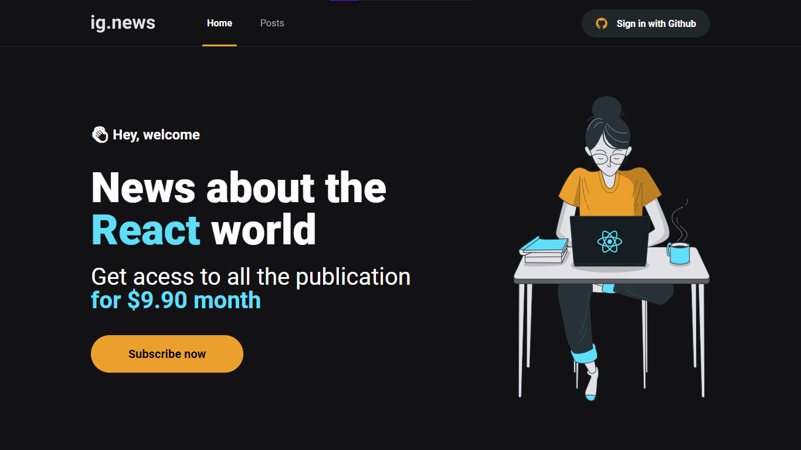
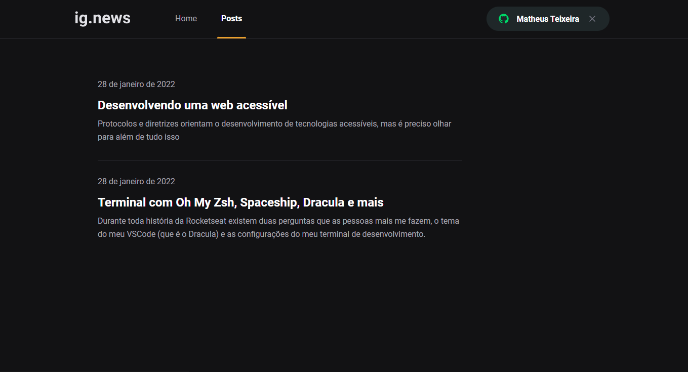

# IGNews

This is an application of a blog with paid content. If you do not have a paid subscription, only the beginning of the post will be visible.

This project was made on the Ignite React track, a Rocketseat course.

## Screenshots




## Setup

Go to the desired folder and run

```bash
  $ git clone https://github.com/matheustsdev/ignews.git

  $ cd ignews
```

Then, install the packages and run the development server with:
(NPM)

```bash
  $ npm install

  $ npm run start
```

or: (YARN)

```bash
  $ yarn

  $ yarn start
```

And you're ready to go!

## Stack

**Front-end:** React, NextJs, Typescript, Context API, Axios, SASS, StripeAPi to payment and FaunaDB.

## Autor

- Github: [@matheustsdev](https://github.com/matheustsdev)
- Linkedin: [Matheus Teixeira](https://www.linkedin.com/in/matheust0105/)
